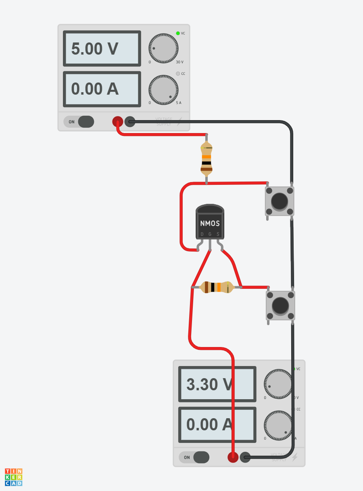
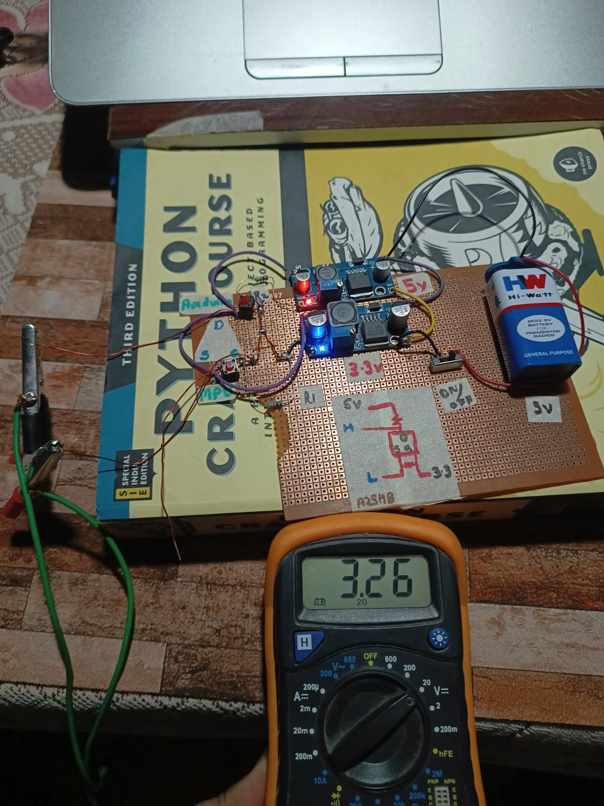
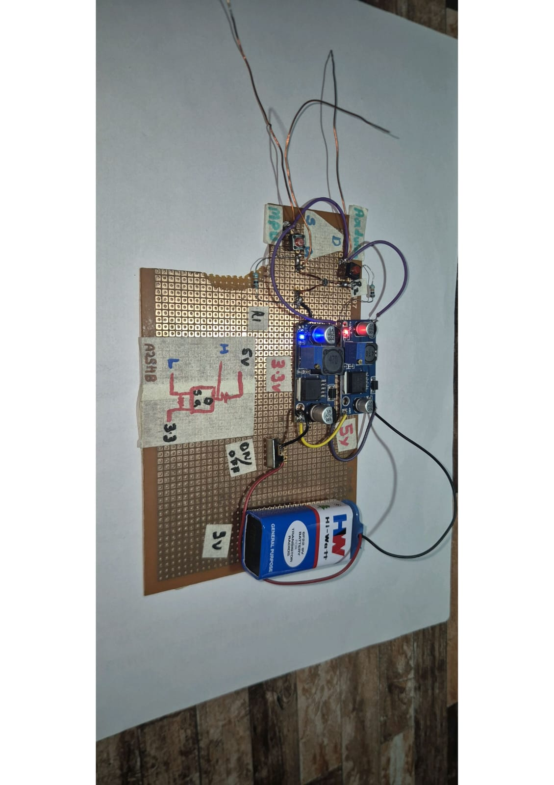
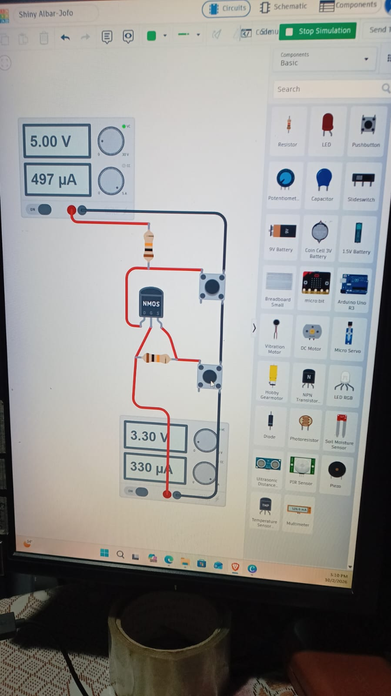

# Bidirectional Logic Level Shifter

A hardware electronics project demonstrating bidirectional logic-level conversion between 3.3 V and 5 V digital devices using an A2SHB MOSFET-based circuit.

The project includes a physical circuit, a Tinkercad circuit simulation, and practical testing with devices operating at different logic voltages.

## Project Overview

Microcontrollers and digital electronic devices can operate at different logic voltage levels. Connecting their signal pins directly may cause unreliable communication or damage components when the voltage limits are exceeded.

This project explores a bidirectional level-shifting circuit that allows compatible digital signals to interface between 3.3 V and 5 V systems.

## Project Objectives

- Design a bidirectional logic-level shifting circuit.
- Assemble the circuit using an A2SHB MOSFET and supporting components.
- Create a circuit simulation in Tinkercad.
- Test the physical circuit with 3.3 V and 5 V devices.
- Understand voltage compatibility and digital signal interfacing.

## Hardware Components

- A2SHB MOSFET
- Supporting resistors and wiring used in the circuit
- Prototyping board
- Connecting wires
- 3.3 V logic device
- 5 V logic device

## Physical Circuit

The circuit was assembled on a prototyping board and tested with devices operating at 3.3 V and 5 V logic levels.

## Tinkercad Simulation

A simulated version of the circuit was created in Tinkercad to visualize the component arrangement and circuit connections.

## when the button is clicked

## How It Works

A MOSFET-based bidirectional level shifter can translate compatible digital signals between two voltage domains.

In a typical circuit of this type:

1. The low-voltage side connects to the 3.3 V logic device.
2. The high-voltage side connects to the 5 V logic device.
3. Appropriate pull-up resistors establish the logic-high voltage on each side.
4. The MOSFET allows compatible signals to be transferred between the two sides in either direction.

The circuit topology, resistor values, and signal protocol determine which applications are supported. This type of circuit is commonly used for open-drain or open-collector signals, such as I²C, rather than every type of digital signal.

## Testing and Validation

- Built the physical circuit.
- Created a Tinkercad simulation of the circuit.
- Tested the physical circuit with 3.3 V and 5 V devices.
- Practiced hardware assembly, wiring, and digital electronics troubleshooting.

## Skills Demonstrated

- Digital electronics
- MOSFET-based circuit design
- Logic-level interfacing
- Hardware prototyping
- Tinkercad circuit simulation
- Circuit testing and troubleshooting

## Applications

Depending on the circuit design and signal requirements, logic-level shifting can be useful when interfacing compatible low-voltage microcontrollers with higher-voltage digital peripherals.

## Future Improvements

- Add a detailed circuit schematic with component values.
- Document the exact devices and signal protocol used during testing.
- Measure and record signal voltage levels with a multimeter or oscilloscope.
- Include additional test cases and photographs.

## Author

**Ashish Singh Chauhan**

GitHub: [ashishsinghchauhanfromtech](https://github.com/ashishsinghchauhanfromtech)
